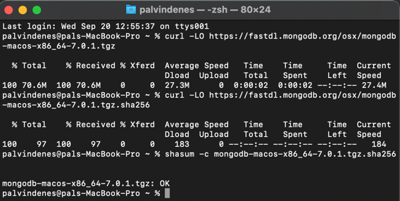
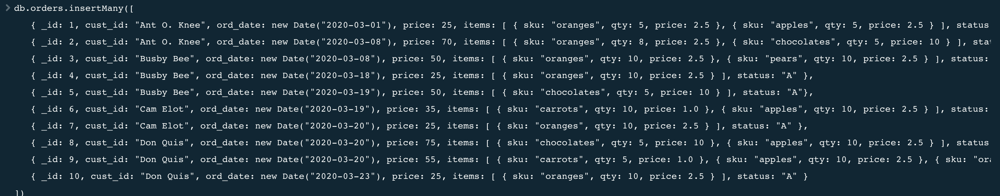
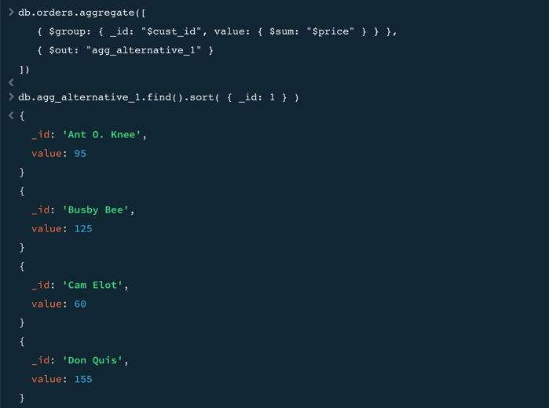
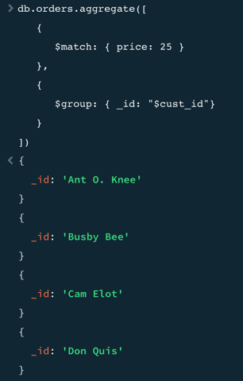
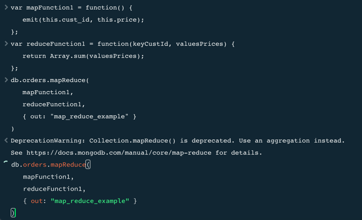

# Short report

I did not encounter any problems with installation. Homebrew installation was very easy as usual.

Verification

From Experiment 1

From Experiment 2
I did not get mapReduce to work.

Here is my additional operation

I could not get mapReduce to work. This is how it looks in my terminal when trying to run the command.

