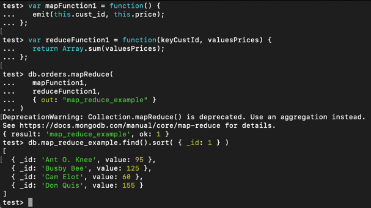
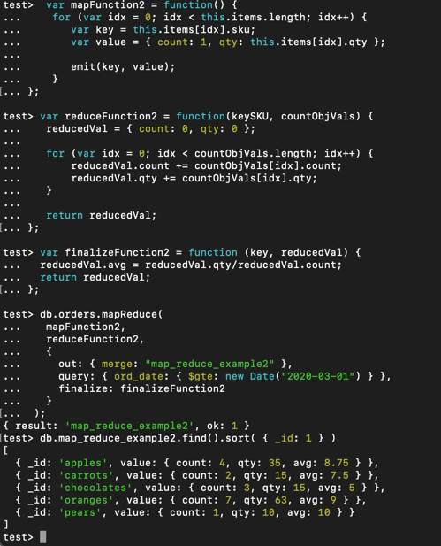
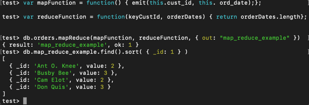

# Short report

I did not encounter any problems with installation. Homebrew installation was very easy as usual.

Verification

From Experiment 1

From Experiment 2
I did not get mapReduce to work.

MapReduce example:

My mapReduce operation

The operation here is useful as it shows how many times an item has been ordered.